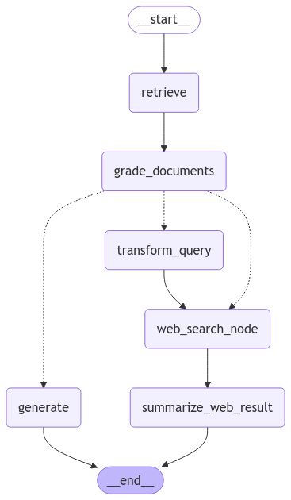

# dev-porn-demo-LangSmith-hub

# 基於 LLM 的檢索增強生成 (RAG) 與評估

本專案實現了使用 LangChain 和 LangSmith 的 **檢索增強生成 (RAG)** 及 **基於 LLM 的評估**。系統透過檢索相關文檔生成答案，並根據標準評估輸出質量。

## 功能特色

- **RAG 工作流程**：
  - 使用向量存儲檢索文檔。
  - 根據檢索上下文生成答案。
  - 以 LangChain 元件構建工作流程。

- **評估工作流程**：
  - 使用評估提示評估答案質量。
  - 使用評估提示評估文檔質量。
  - 根據標準對輸出進行評分。

- **LangSmith 集成**：
  - 可視化並追蹤工作流程。

- **Hub 提供的 Prompt 實用性**：
  - **適配性高**：從 LangSmith Hub 拉取經驗證的 Prompt。
  - **模組化設計**：支援整合，適應不同場景。

## LLM 類別

`llm.py` 中的 `Llm` 類別提供與大型語言模型互動的功能，包括：
- 文件檢索、摘要、評估和問題重寫。
- 使用 OpenAI 的嵌入和聊天模型進行處理。

## 工作流程

`workflow.py` 定義了狀態圖，包含以下步驟：
1. **檢索文件**：根據問題從向量存儲中檢索相關文件。
2. **評估文件**：評估文件的相關性，決定是否需要網路搜尋。
3. **生成答案**：使用 RAG 流程生成答案。
4. **改寫問題**：提高檢索準確性。
5. **網路搜尋**：查詢問題並更新文件列表。
6. **生成摘要**：根據網路搜尋結果生成摘要。

## Hub Prompt 的應用

專案從 LangChain Hub 拉取了以下兩個 Prompt：
1. **RAG Prompt**（`daethyra/rag-prompt`）：生成準確且相關的答案。
2. **評估 Prompt**（`jisujiji/rag-prompt`）：評估生成答案的質量。
2. **評估 Prompt**（`teddynote/retrieval-question-grader`）：評估檢索的文檔的質量。

### Hub Prompt 的優勢
- **即插即用**：利用社群驗證的模版。
- **靈活擴展**：根據需求進行調整。
- **準確性**：為特定任務設計，確保準確性。

---

### Graph workflow
